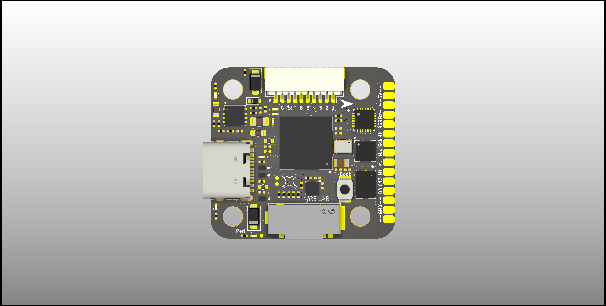
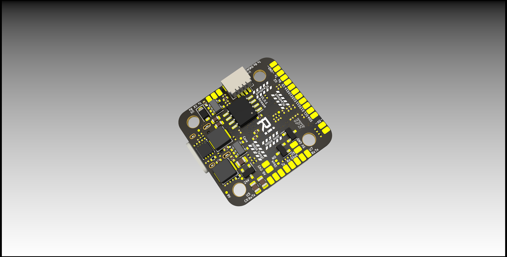

# NxtPX4-Hardware

Hardware design for NxPX4

NxtPx4 is designed by HKUST UAV-Group and tested and maitened with HKU Mars-Lab.

NxtPx4_Pro version has 9v 2.5A and 5V 3A peak power output

NxtPx4 version has 5V 3A power output

## File tree

NxPx4_Pro/xxx_Vx.x.x_Release：KICAD project

* xxxxxxx_production: manufact files for JLC
* project_lib: Footprint lib and Symble lib for project

## Hardware design information

### Caution!!!!!!!!

In the v1.0.1 design, the original concept was to create an unusual ESC connector order to prompt users to notice the pinout sequence. However, in practice, the placement of the Rx pin in close proximity to the Vbat pin resulted in MCU damage during power on/off if the cable was not tightly installed (causing a high voltage spark). Realizing this issue, the v1.1.0 design changed the ESC pinout order to address this problem.

If you are using v1.0.1 of the NxtPX4 flight controller (which can be found at the back of the PCB), it is important to pay attention to your connection with the ESC. Specifically, it is recommended that you do not disconnect or connect the NxtPX4 while the ESC is already powered on, as this can cause damage to the flight controller.
(v1.0.1 Design)

(v1.1.0)

~~To avoid burning the LDO module of NxtPX4 due to the large current generated by the 6S RC-Battery at power-on, we strongly recommend connecting the NxtPX4 flight controller to the ESC first, and then powering on the ESC to activate the NxtPX4. In previous power tests, there were multiple instances of LDO module burnout on the NxtPX4 flight controller due to directly connecting/disconnecting it with an already powered ESC. It should be noted that due to the small size of the NxtPX4, replacing the LDO module can be a challenging task.~~

---

27mm x 29mm x 8mm

### MCU&Sensors&Peripher Device

* MCU:STM32H743VIH
* IMU
  * MPU6500 SPI1
  * ICM20602 SPI2
  * BMI088 SPI3
* Baro
  * BMP388 I2C1
* TF-card: SDMMC1
* External Flash: QSPI

### Function support

* 6-CH Dshot 600 support
* Uart1|2|3|4|5|7 available
  * uart 7: serial RC receiver
  * usart 1: aux
  * usart 2: aux
  * usart 3: aux
  * uart 5 : aux serrial
  * uart 4: serial communication with upper board
* I2C2|SPI4 available
* Aux 2 PWM channel available (Heater & RGB & Buzzer control signal)
* Buzzer- available
* Aux 2 GPIO Available

> for more information please reffer to /STM32H743VI_Pin_Out/STM32H743xxx_Pin_out.xlsx
