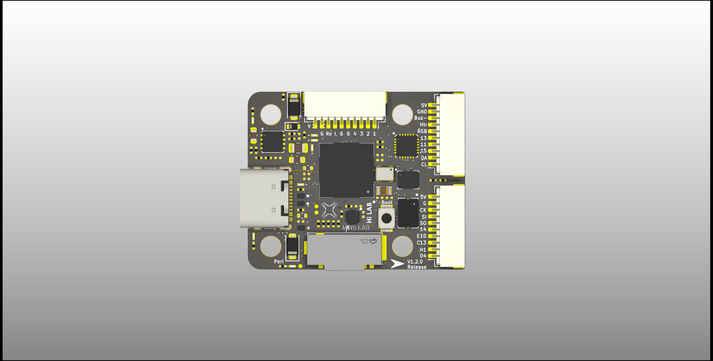
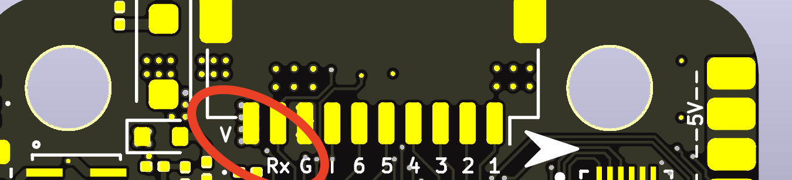
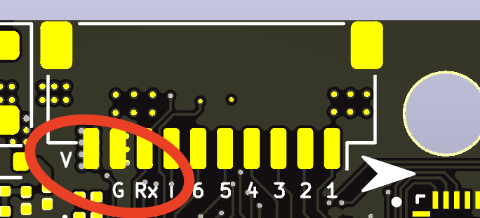

# NxtPX4-Hardware v1.2.0 release

Hardware design for NxPX4

NxtPx4 is designed by HKUST UAV-Group and tested and maitened with HKU Mars-Lab and SYSU Hi-Lab

NxtPx4_Pro version () has 9v 2.5A and 5V 3A peak power output

NxtPx4 version has 5V 3A power output

## File tree

NxPx4_Pro/xxx_Vx.x.x_Release：KICAD project

* xxxxxxx_production: manufact files for JLC
* project_lib: Footprint lib and Symble lib for project

## Hardware design information

27mm x 29mm x 8mm

### MCU&Sensors&Peripher Device

* MCU
  STM32H743VIH
* IMU
  | IMU         | SPI BUS |
  | ----------- | ------- |
  | ICM20649    | SPI1    |
  | ICM-42688-P | SPI2    |
  | BMI088      | SPI3    |
* Baro
  BMP388
* TF-card: SDMMC1
* External Flash: QSPI

### Function support

* 6-CH Dshot 600 support
* UART tty-port  serial-name  mapping
  | UART   | TTY        | SerialName  | Suggest Funcion                |
  | ------ | ---------- | ----------- | ------------------------------ |
  | USART1 | /dev/ttyS0 | SERIAL_GPS1 | AUX                            |
  | USART2 | /dev/ttyS1 | SERIAL_GPS2 | AUX                            |
  | USART3 | /dev/ttyS2 | SERIAL_TEL1 | ESC report                     |
  | UART4  | /dev/ttyS3 | SERIAL_TEL2 | Connect with offboard computer |
  | UART5  | /dev/ttyS4 | SERIAL_RC   | Receiver                       |
  | UART7  | /dev/ttyS5 | SERIAL_TEL3 | AUX                            |
* I2C2|SPI4 available
* Aux 2 PWM channel available (Heater & RGB & Buzzer control signal)
* Buzzer- available
* Aux 2 GPIO Available

> for more information please reffer to /STM32H743VI_Pin_Out/STM32H743xxx_Pin_out.xlsx

## Caution!!!!!!!!

### V1.2.0

### V1.0.0

In the v1.0.1 design, the original concept was to create an unusual ESC connector in order to prompt users to notice the pinout sequence. However, in practice, the placement of the Rx pin in close proximity to the Vbat pin resulted in MCU damage during power on/off if the cable was not tightly installed (causing a high voltage spark). Realizing this issue, the v1.1.0 design changed the ESC pinout order to address this problem.

If you are using v1.0.1 of the NxtPX4 flight controller (which can be found at the back of the PCB), it is important to pay attention to your connection with the ESC. Specifically, it is recommended that you do not disconnect or connect the NxtPX4 while the ESC is already powered on, as this can cause damage to the flight controller.
(v1.0.1 Design)

(v1.1.0)
