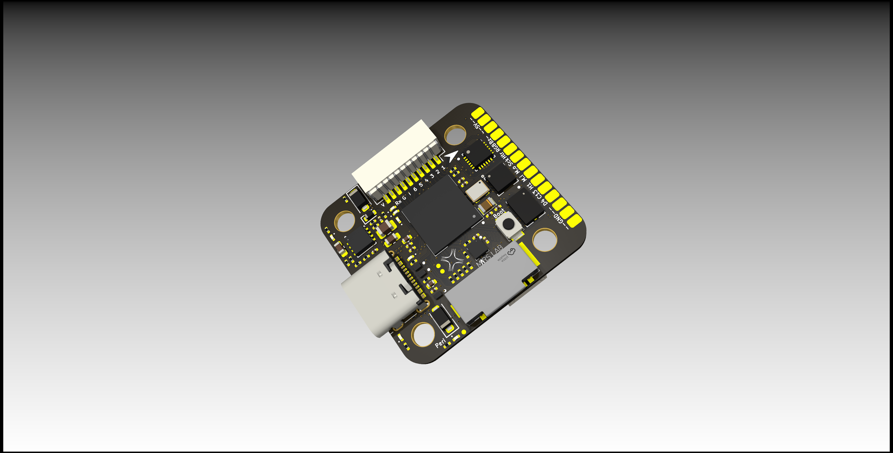

# NxtPX4-Hardware

Hardware design for NxPX4

NxtPx4 is designed by HKUST UAV-Group and tested and maitened with HKU Mars-Lab.

NxtPx4_Pro version has 9v 2.5A and 5V 3A peak power output

NxtPx4 version has 5V 3A power output

## File tree

NxPx4_Pro/xxx_Vx.x.x_Release：KICAD project

* xxxxxxx_production: manufact files for JLC
* project_lib: Footprint lib and Symble lib for project

## Hardware design information

27mm x 29mm x 8mm

### MCU&Sensors&Peripher Device

* MCU:STM32H743VIH
* IMU
  * MPU6500 SPI1
  * ICM20602 SPI2
  * BMI088 SPI3
* Baro
  * BMP388 I2C1
* TF-card: SDMMC1
* External Flash: QSPI

### Function support

* 6-CH Dshot 600 support
* Uart1||3|4|5|7 available
* I2C2|SPI4 available
* Aux 2 PWM channel available (Heater & RGB & Buzzer control signal)
* Buzzer- available
* Aux 2 GPIO Available

> for more information please reffer to /STM32H743VI_Pin_Out/STM32H743xxx_Pin_out.xlsx
